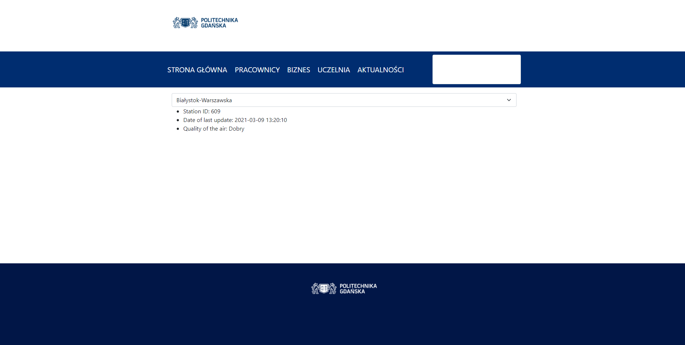

# 417-pg-weather

Current state:

- Get list of data to prepare select
- After select send AJAX request to get single station data
- fix data to the rendered template and send to view
- Insert request inside selected item
